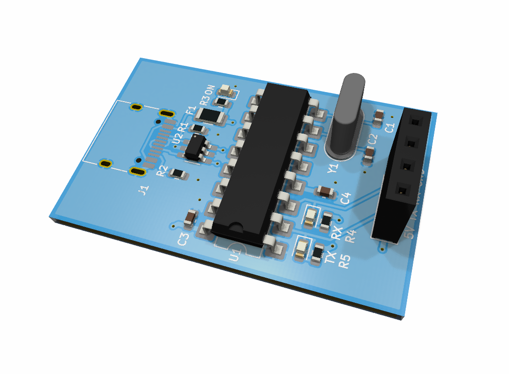

# USB UART CH340

A custom **USB-to-UART converter** designed in **KiCad** using the **CH340** USB-to-serial interface.

This project was created as a practical PCB design project to gain hands-on experience with schematic design, PCB layout, component placement, routing, and hardware interfacing for embedded systems.

## 📷 Board

<p align="center">
  
</p>

## 🔧 Features

* USB to UART communication
* CH340 USB-to-Serial interface
* UART TX/RX interface
* Designed for embedded development and debugging
* Custom PCB designed in KiCad
* Compact and practical development tool

The CH340 provides a USB interface on the computer side and a hardware full-duplex serial interface on the MCU side.

## 🛠️ Hardware

| Component          | Description                        |
| ------------------ | ---------------------------------- |
| CH340              | USB-to-UART interface              |
| USB connector      | USB connection to PC               |
| UART header        | TX / RX / VCC / GND interface      |
| LEDs               | Communication / status indication  |
| Passive components | Decoupling and interface circuitry |

## 💻 Applications

This board can be used as a USB-to-UART interface for embedded development, debugging, and serial communication with microcontrollers such as:

* STM32
* ESP32
* AVR
* Arduino
* Other UART-based embedded systems

USB-to-UART converters are commonly used to communicate with microcontrollers and can also be used for firmware programming when the target hardware supports the required boot/programming interface.

## 📐 Design

The complete hardware design was developed in **KiCad**, including:

* Schematic design
* Component selection
* PCB layout
* Routing
* Design verification
* PCB manufacturing files

### Project Files

```text
USB_UART_CH340/
├── USB_UART_CH340.kicad_pro
├── USB_UART_CH340.kicad_sch
├── USB_UART_CH340.kicad_pcb
├── USB_UART_CH340.kicad_prl
├── images/
│   └── board.jpg
└── README.md
```

## 📚 Learning Objectives

This project was developed to strengthen practical skills in:

* PCB design with KiCad
* USB-to-UART interfaces
* UART communication
* Hardware design for embedded systems
* Schematic capture
* PCB layout and routing
* Component placement
* Hardware debugging

## 🚧 Project Status

**Completed**

The KiCad schematic and PCB design are available in this repository.

## 📌 Future Improvements

Possible future revisions may include:

* 3.3 V / 5 V selectable UART levels
* Automatic boot/reset circuitry for supported MCUs
* ESD protection
* Improved USB protection
* Smaller PCB footprint
* Additional UART control signals

## 📄 License

This project is provided for educational and personal development purposes.
